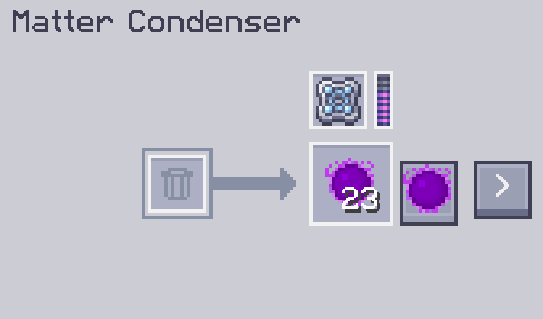
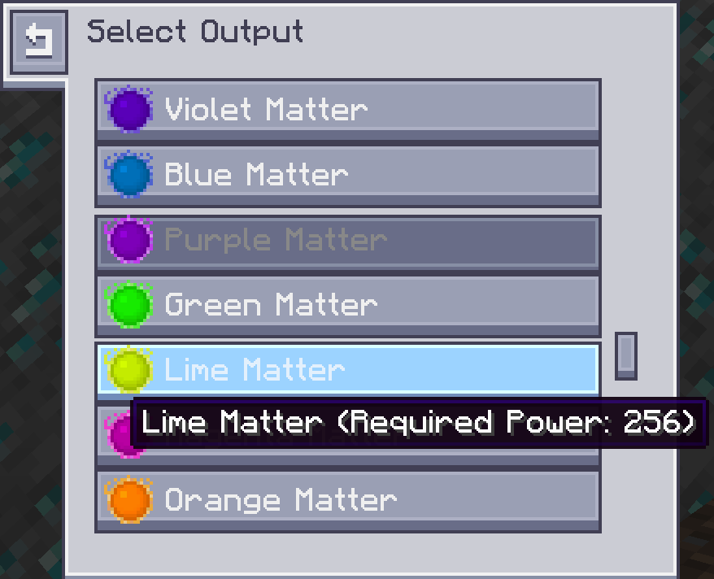
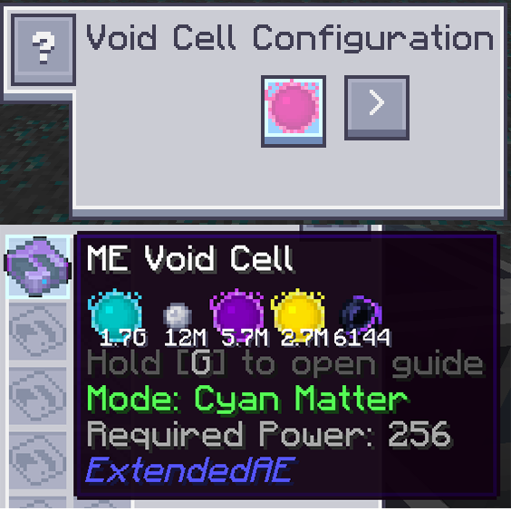
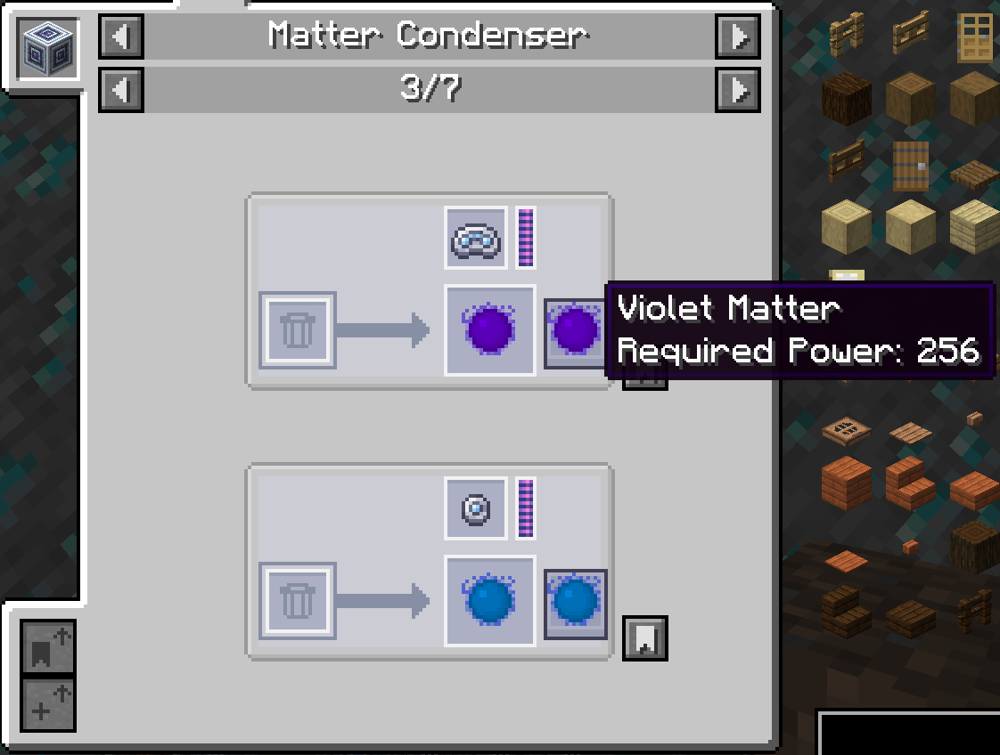

# AE2 Matter Condenser Recipe

[Click to view English version](#english)

这个模组把 AE2 的物质聚合器改成了配方驱动。  
不再只固定产出物质球/奇点，产物和需求都可以通过配方数据包调整。  
同样的逻辑也支持 [ExtendedAE](https://www.curseforge.com/minecraft/mc-mods/ex-pattern-provider) 的 ME虚空元件。

---

### 物质聚合器

- 可以在 GUI 里直接切换产物。
- `>` 按钮可打开选择窗口，按列表选目标产物。



### 选择窗口

- 产物列表支持滚动，产物多时也能正常浏览。



### 支持 ME虚空元件



### JEI / EMI / REI 适配

- 配方页面已适配，会按当前配方数据展示内容。
- JEI 兼容需要 [AE2 JEI Integration](https://www.curseforge.com/minecraft/mc-mods/ae2-jei-integration) 模组



---

### 配方示例

```json
{
  "type": "ae2mcr:condenser",
  "result": {
    "id": "minecraft:iron_ingot",
    "count": 1
  },
  "required_power": 1024
}
```

### 支持 KubeJS 编写配方

```js
ServerEvents.recipes((event) => {
  event.recipes.ae2mcr.condenser('minecraft:diamond', 8192)
})
```

---

## English

This mod turns AE2's Matter Condenser into a recipe-driven system.  
It no longer only outputs Matter Balls/Singularities with fixed behavior; both outputs and required power can be adjusted through recipe data packs.  
The same logic also supports ExtendedAE [ME Void Cell](https://www.curseforge.com/minecraft/mc-mods/ex-pattern-provider).

---

### Matter Condenser

- You can switch outputs directly in the GUI.
- The `>` button opens a selector window where you can choose the target output from a list.


### Selector Window

- The output list is scrollable, so browsing still works well when there are many outputs.


### ME Void Cell Support


### JEI / EMI / REI Compatibility

- Recipe pages are supported and display content based on current recipe data.
- JEI compatibility requires the [AE2 JEI Integration](https://www.curseforge.com/minecraft/mc-mods/ae2-jei-integration) mod.


---

### Recipe Example

```json
{
  "type": "ae2mcr:condenser",
  "result": {
    "id": "minecraft:iron_ingot",
    "count": 1
  },
  "required_power": 1024
}
```

### KubeJS Recipe Support

```js
ServerEvents.recipes((event) => {
  event.recipes.ae2mcr.condenser('minecraft:diamond', 8192)
})
```
