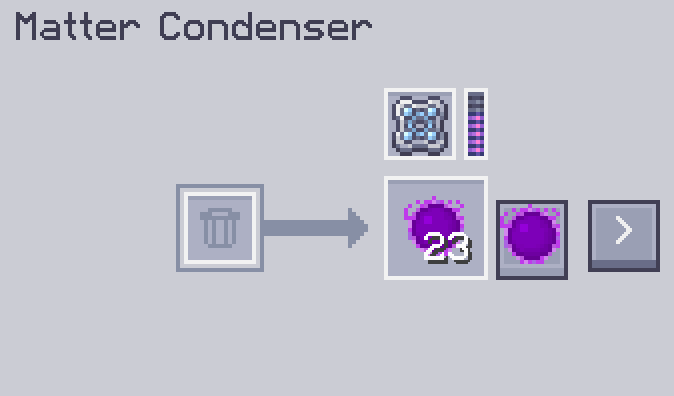
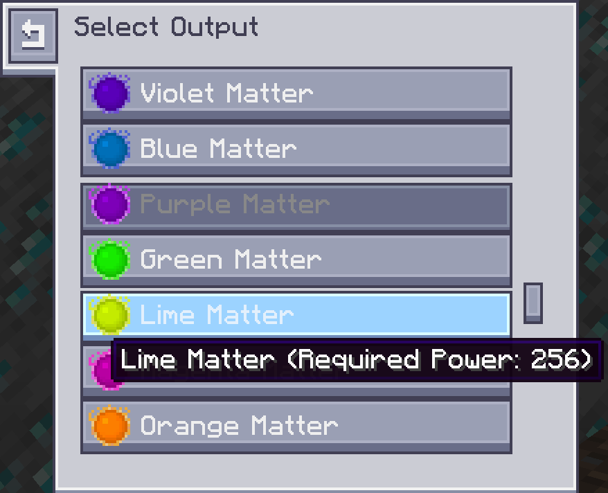
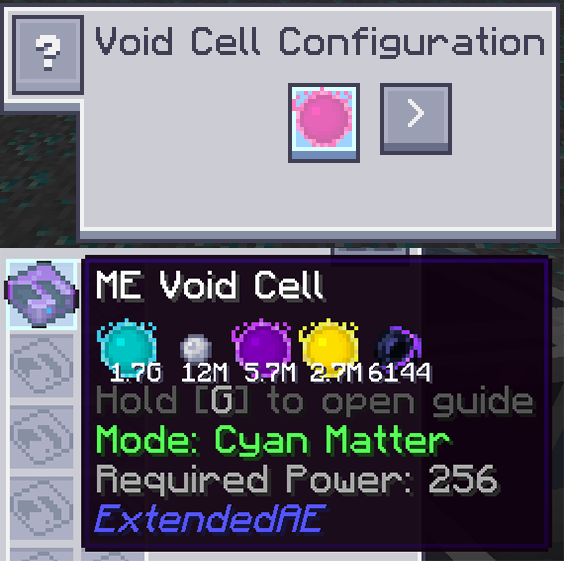
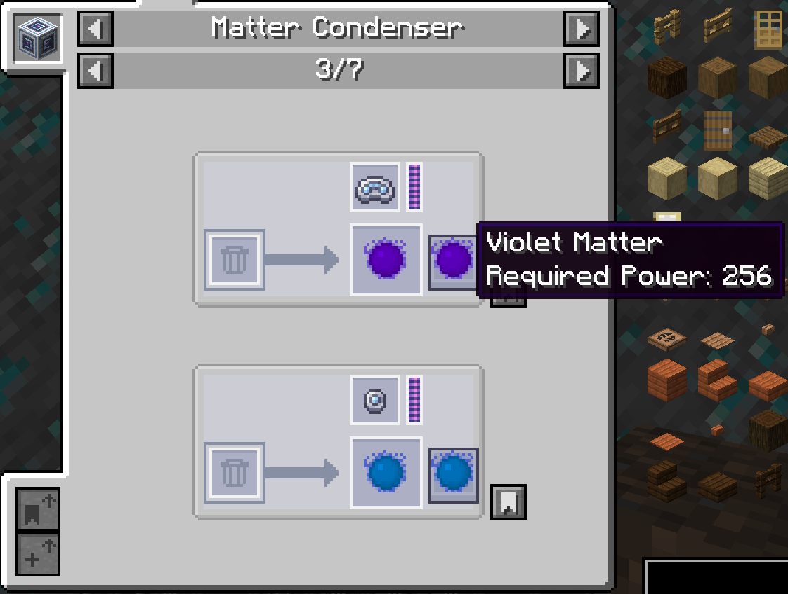

# AE2 Matter Condenser Recipe

[Click to view English version](#english)

这个模组把 AE2 的物质聚合器改成了配方驱动。  
不再只固定产出物质球/奇点，产物和需求都可以通过配方数据包调整。  
同样的逻辑也支持 [ExtendedAE](https://www.curseforge.com/minecraft/mc-mods/ex-pattern-provider) 的 ME虚空元件 和 [DataEnergistics](https://www.curseforge.com/minecraft/mc-mods/data-energistics) 数据捕捉球配方。

---

### 配方示例
catalyst 为可选项，未指定时会使用配置文件`config/ae2mcr.toml`里的默认规则

```json
{
  "type": "ae2mcr:condenser",
  "catalyst": [
    {
      "item": "minecraft:iron_ingot"
    },
    {
      "item": "minecraft:gold_ingot"
    },
    {
      "item": "minecraft:diamond"
    }
  ],
  "result": {
    "id": "minecraft:nether_star",
    "count": 1
  },
  "required_power": 131072
}
```

### KubeJS 配方示例

```js
ServerEvents.recipes((event) => {
  // 输出物品（可带组件数据），所需能量（大于0的整型），催化剂（也就是存储组件，可以用标签）[]-可选
  event.recipes.ae2mcr.condenser('minecraft:diamond', 8192)
  event.recipes.ae2mcr.condenser('minecraft:bedrock', 2147483647)
  event.recipes.ae2mcr.condenser('minecraft:diamond_block', 73728, ['#c:storage_blocks'])
  event.recipes.ae2mcr.condenser('minecraft:gold_block', 4096, ['minecraft:enchanted_golden_apple', '#c:storage_blocks'])
  event.recipes.ae2mcr.condenser('minecraft:enchanted_book[stored_enchantments={levels:{"minecraft:fortune":3}}]', 2097152)
})
```

### 界面与兼容

- 可以在 GUI 里直接切换产物。
- `>` 按钮可打开选择窗口，按列表选目标产物。



### 选择窗口

- 产物列表支持滚动，产物多时也能正常浏览。



### 支持 ME虚空元件



### JEI / EMI / REI 适配

- 配方页面已适配，会按当前配方数据展示内容。
- JEI 兼容需要 [AE2 JEI Integration](https://www.curseforge.com/minecraft/mc-mods/ae2-jei-integration) 模组



---

## English

This mod turns AE2's Matter Condenser into a recipe-driven system.  
It no longer only outputs Matter Balls/Singularities with fixed behavior; both outputs and required power can be adjusted through recipe data packs.  
The same system also supports ExtendedAE [ME Void Cell](https://www.curseforge.com/minecraft/mc-mods/ex-pattern-provider) and [DataEnergistics](https://www.curseforge.com/minecraft/mc-mods/data-energistics) Data Capture Ball recipes.

---

### Recipe Example
`catalyst` is optional. If omitted, the recipe uses the default rules from `config/ae2mcr.toml`.

```json
{
  "type": "ae2mcr:condenser",
  "catalyst": [
    {
      "item": "minecraft:iron_ingot"
    },
    {
      "item": "minecraft:gold_ingot"
    },
    {
      "item": "minecraft:diamond"
    }
  ],
  "result": {
    "id": "minecraft:nether_star",
    "count": 1
  },
  "required_power": 131072
}
```

### KubeJS Recipe Example

```js
ServerEvents.recipes((event) => {
  // output item (components supported), required energy (> 0 integer), optional catalyst list
  event.recipes.ae2mcr.condenser('minecraft:diamond', 8192)
  event.recipes.ae2mcr.condenser('minecraft:bedrock', 2147483647)
  event.recipes.ae2mcr.condenser('minecraft:diamond_block', 73728, ['#c:storage_blocks'])
  event.recipes.ae2mcr.condenser('minecraft:gold_block', 4096, ['minecraft:enchanted_golden_apple', '#c:storage_blocks'])
  event.recipes.ae2mcr.condenser('minecraft:enchanted_book[stored_enchantments={levels:{"minecraft:fortune":3}}]', 2097152)
})
```

### UI And Compatibility

- You can switch outputs directly in the GUI.
- The `>` button opens a selector window where you can choose the target output from a list.


### Selector Window

- The output list is scrollable, so browsing still works well when there are many outputs.


### ME Void Cell Support


### JEI / EMI / REI Compatibility

- Recipe pages are supported and display content based on current recipe data.
- JEI compatibility requires the [AE2 JEI Integration](https://www.curseforge.com/minecraft/mc-mods/ae2-jei-integration) mod.


